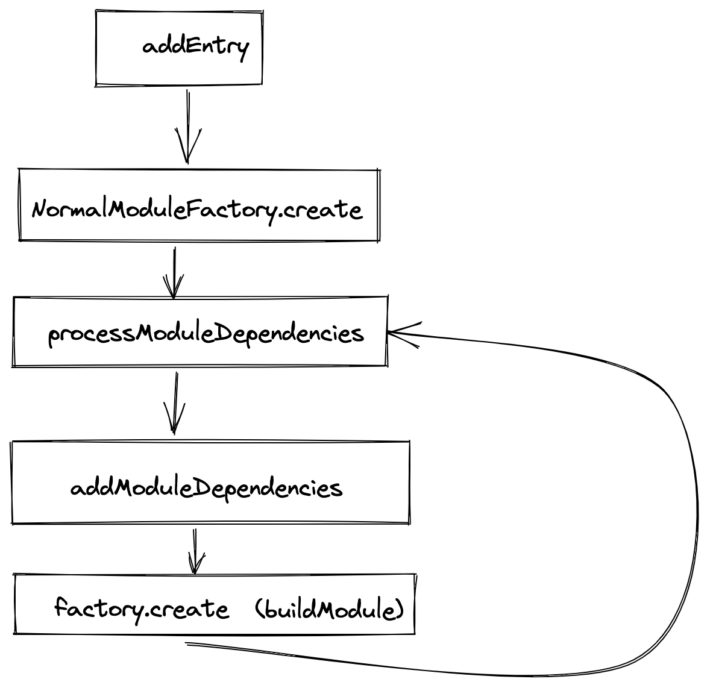

# webpack 学习

## dependency 解析

webpack最新的5.x版本中，dependency解析依赖两个核心类完成：NormalModuleFactory 和 JavascriptParser

基本思想是，入口上下文信息会被一个实例表示，根据这个实例的构造函数找到对应的 module factory，对于js来说，基本都是NormalModuleFactory

```js
const factory = compiliation.dependencyFactories.get(EntryDependency)
```
从factory中构造Module实例，比如NormalModule, 传入实例中的一个比较重要的属性是parser, 它用于解析js文件，从中找出可能的依赖，进行循环处理
parser提供了比较多的hook用于处理 ast解析环节的狗子

### webpack 4.x 版本

从Compilation实例的addEntry方法开始 寻找依赖，生成module实例，存放在Compilation实例中的modules，逻辑流程图如下



1. factory.create方法中，执行resolve解析步骤，并生成module实例，大部分是NomralModule实例
2. 调用module实例的build方法
3. 在module build执行过程中，运行loaders，返回 source 文本，接着生成ast文件
4、解析ast文件后，module的dependencies包含很多dependency实例
5、遍历moduel.dependencies, 找到对应的factory, 然后执行上述步骤1，循环

如下是在一个项目中断点打出的factory 和dependency类型的映射

```js
[
  ["CssDependency", "CssModuleFactory"],
  ["ConstDependency", "NullFactory"],
  ["WebAssemblyImportDependency", "NormalModuleFactory"],
  ["WebAssemblyExportImportedDependency", "NormalModuleFactory"],
  ["MultiEntryDependency", "MultiModuleFactory"],
  ["SingleEntryDependency", "NormalModuleFactory"],
  ["HarmonyCompatibilityDependency", "NullFactory"],
  ["HarmonyInitDependency", "NullFactory"],
  ["HarmonyImportSideEffectDependency", "NormalModuleFactory"],
  ["HarmonyImportSpecifierDependency", "NormalModuleFactory"],
  ["HarmonyExportHeaderDependency", "NullFactory"],
  ["HarmonyExportExpressionDependency", "NullFactory"],
  ["HarmonyExportSpecifierDependency", "NullFactory"],
  ["HarmonyExportImportedSpecifierDependency", "NormalModuleFactory"],
  ["HarmonyAcceptDependency", "NullFactory"],
  ["HarmonyAcceptImportDependency", "NormalModuleFactory"],
  ["AMDRequireDependency", "NullFactory"],
  ["AMDRequireItemDependency", "NormalModuleFactory"],
  ["AMDRequireArrayDependency", "NullFactory"],
  ["AMDRequireContextDependency", "ContextModuleFactory"],
  ["AMDDefineDependency", "NullFactory"],
  ["UnsupportedDependency", "NullFactory"],
  ["LocalModuleDependency", "NullFactory"],
  ["CommonJsRequireDependency", "NormalModuleFactory"],
  ["CommonJsRequireContextDependency", "ContextModuleFactory"],
  ["RequireResolveDependency", "NormalModuleFactory"],
  ["RequireResolveContextDependency", "ContextModuleFactory"],
  ["RequireResolveHeaderDependency", "NullFactory"],
  ["RequireHeaderDependency", "NullFactory"],
  ["LoaderDependency", "NormalModuleFactory"],
  ["RequireIncludeDependency", "NormalModuleFactory"],
  ["RequireEnsureItemDependency", "NormalModuleFactory"],
  ["RequireEnsureDependency", "NullFactory"],
  ["RequireContextDependency", "ContextModuleFactory"],
  ["ContextElementDependency", "NormalModuleFactory"],
  ["ImportDependency", "NormalModuleFactory"],
  ["ImportEagerDependency", "NormalModuleFactory"],
  ["ImportWeakDependency", "NormalModuleFactory"],
  ["ImportContextDependency", "ContextModuleFactory"]
]

```
NullFactory的create方法是一个空的函数

对于vue文件，使用vue-loader去解析vue文件，解析vue文件的过程中，vue文件第一步 被 vue-loader加载成如下格式
```js
import { render, staticRenderFns } from "./error.vue?vue&type=template&id=a85b39f0&"
import script from "./error.vue?vue&type=script&lang=js&"
export * from "./error.vue?vue&type=script&lang=js&"
import style0 from "./error.vue?vue&type=style&index=0&lang=scss&"


/* normalize component */
import normalizer from "!../node_modules/vue-loader/lib/runtime/componentNormalizer.js"
var component = normalizer(
  script,
  render,
  staticRenderFns,
  false,
  null,
  null,
  null
  
)

export default component.exports
```
然后解析依赖，重复上面的步骤，对于不同的依赖类型，loader的数量有差异，其中extract-css-chunk-webpack-plugin 插件的loader, 会调用
Compilation实例的createChildCompiler方法，然后添加新的entry, 比如

loader中有一个pitch方法，它的流程参考https://webpack.js.org/api/loaders/， pitch方法先执行，后面再执行loader的默认方法

```json
[{
  "request": "/Users/klook/Documents/work/temp/klook-web-hotel/node_modules/html-webpack-plugin/lib/loader.js!/Users/klook/Documents/work/temp/klook-web-hotel/app.html"
}, {
  "request": "/Users/klook/Documents/work/temp/klook-web-hotel/node_modules/html-webpack-plugin/lib/loader.js!/Users/klook/Documents/work/temp/klook-web-hotel/app.html"
}, {
  "name": "app"
}, {
  "name": "extract-css-chunks-webpack-plugin",
  "request": "!!/Users/klook/Documents/work/temp/klook-web-hotel/node_modules/css-loader/dist/cjs.js??ref--7-oneOf-1-1!/Users/klook/Documents/work/temp/klook-web-hotel/node_modules/vue-loader/lib/loaders/stylePostLoader.js!/Users/klook/Documents/work/temp/klook-web-hotel/node_modules/postcss-loader/src/index.js??ref--7-oneOf-1-2!/Users/klook/Documents/work/temp/klook-web-hotel/node_modules/sass-loader/dist/cjs.js??ref--7-oneOf-1-3!/Users/klook/Documents/work/temp/klook-web-hotel/node_modules/vue-loader/lib/index.js??vue-loader-options!/Users/klook/Documents/work/temp/klook-web-hotel/components/common/svg-icon.vue?vue&type=style&index=0&lang=scss&"
}]
```

在实际项目中断点打的addEntry数量有208个，基本都是extract-css-chunks-webpack-plugin产生的


## webpack bootstrap 源码

webpack bootstrap是 webpack打包之后的启动代码，以下部分是基于webpack 4.x的源码逻辑，在webpack 5.x中，MainTemplate文件被废弃掉了

在MainTemplate.js里面定义了 renderBootstrap方法，返回bootstrap的代码 大致如下

在window下面挂载了一个变量 `webpackJsonp`, 这个变量名可以在 output options里面可以更改，webpackJsonp是一个普通的数据，其push方法被绑定成webpackJsonpCallback

然后对chunk代码的加载，其模式是

```js
(window['webpackJsonp'] = window['webpackJsonp'] || []).push([[188], [moreModules], [exectedModules]])
```

因此从webpackJsonp中可以看出加载了多少个chunk, 以及所有的module模块；在实际加载chunk的时候，执行的是webpackJsonpCallback方法，参数如上，是一个多维数组

```js
function webpackJsonpCallback(data) {
  const chunkIds = data[0]
  const moreModules = data[1]
  const exectedModules = data[2]

  const resolves = []
  chunkIds.forEach(function(chunkId){
    if (Object.prototype.hasOwnProperty.call(installedChunks, chunkId) && installedChunks[chunkId]) {
      resolves.push(installedChunks[chunkId][0])
    }
    installedChunks[chunkId] = 0 // 0 标记chunk loaded
  })

  for (m in moreModules) {
    if (Object.prototype.hasOwnProperty.call(moreModules, m)) {
      // 缓存模块
      modules[m] = moreModules[m]
    }
  }

  if(parentJsonpFunction) parentJsonpFunction(data)

  while (resolves.length) {
    reosolves.shift()()
  }

  deferedModuels.push.apply(deferedModules, execedModules)

  return checkDeferredModules()
}
```

下载chunk js文件，然后执行上面的webpackJsonpCallback函数，缓存chunk里面包含的module，后面代码执行的时候，实际通过`__webpack_require__(moduleId)` 加载模块，类似于源码里面的
`const vue = require('vue')`

在__webpack_require__，执行具体的模块加载逻辑，该function下面也挂载了一些扩展extension方法，比如（__webpack_require__.s, __webpack_require__.c等），其中比较重要的是
`__webpack_require__.e`, 增加script标签来加载chunk js文件，chunk js的路径通过jsonpScriptSrc方法获取

```js
(function(modules){
  function webpackJsonpCallback(data) {}

  function checkDeferredModules() {}

  var installedModules = []

  var installedChunks = {}

  var installedCssChunks = []

  function jsonpScriptSrc(chunkId) {}

  function __webpack_require__(moduleId) {}

  // require function shortcuts:
  // __webpack_require__.s = the module id of the entry point
  // __webpack_require__.c = the module cache
  // __webpack_require__.m = the module functions
  // __webpack_require__.p = the bundle public path
  // __webpack_require__.i = the identity function used for harmony imports
  // __webpack_require__.e = the chunk ensure function
  // __webpack_require__.d = the exported property define getter function
  // __webpack_require__.o = Object.prototype.hasOwnProperty.call
  // __webpack_require__.r = define compatibility on export
  // __webpack_require__.t = create a fake namespace object
  // __webpack_require__.n = compatibility get default export
  // __webpack_require__.h = the webpack hash
  // __webpack_require__.w = an object containing all installed WebAssembly.Instance export objects keyed by module id
  // __webpack_require__.oe = the uncaught error handler for the webpack runtime
  // __webpack_require__.nc = the script nonce

  var jsonpArray = window['webpackJsonp'] = window['webpackJsonp'] || []
  var jsonpOldFunction = jsonpArray.push.bind(jsonpArray)
  jsonpArray.push = webpackJsonpCallback
  jsonpArray = jsonpArray.slice()

  for(; var i < jsonpArray.length; i++) {
    webpackJsonpCallback(jsonpArray[i])
  }
  var parentJsonpFunction = jsonpOldFunction

  checkDeferredModules()
})([])
```